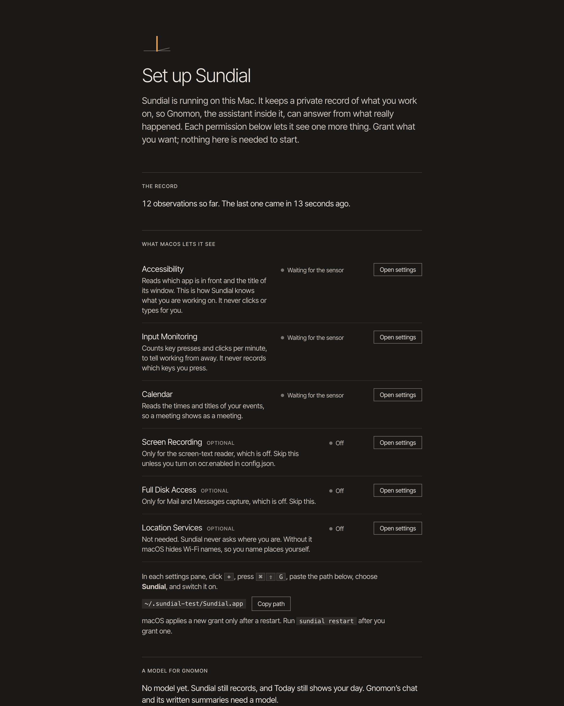

# Sundial

**Sundial is a local-first context engine for your Mac: it watches what you work on — apps, windows, git, calendar, shell — and folds it into a private, searchable record on your own disk.**

**Gnomon is the assistant that lives inside it:** it reads that record, answers from what really happened, and speaks first when it notices something.



## Quickstart

```bash
git clone https://github.com/Angelista-Enterprise/sundial.git && cd sundial
node bin/sundial install
node bin/sundial open
```

`install` checks your Mac, builds everything, writes `~/.sundial/`, and starts
Sundial at login. `open` signs your browser in and shows the setup page, which
walks you through the macOS permissions. The first observations arrive within a
minute. Measured on a clean clone: about 30 seconds with warm caches; plan on a
few minutes for the first dependency download.

Gnomon needs a model to talk. Without one, Sundial still records and the Today
screen still shows your day. Choose one on the `/setup` page (Ollama on this Mac,
OpenAI, OpenRouter, DeepSeek or any OpenAI-compatible address), or add one line
pair to `~/.sundial/.env`:

```bash
# local, nothing leaves your Mac (Ollama)
SUNDIAL_LLM_BASE_URL=http://127.0.0.1:11434/v1
SUNDIAL_LLM_MODEL=qwen3:8b
```

Any OpenAI-compatible endpoint works (set `SUNDIAL_LLM_API_KEY` for a hosted one).
Then `node bin/sundial restart`. More providers can be added on `/setup`; you
pick one per conversation in the chat's model picker.

## The privacy promise

- **Your record stays on your Mac.** One SQLite file, `~/.sundial/sundial.db`,
  private to your user (0600). No account, no cloud, no telemetry.
- **Nothing leaves until you choose a model.** Then only sanitized text goes to
  the endpoint *you* set — point it at a local model and nothing leaves at all.
  Every model call is listed in the Ledger.
- **Redaction happens once, at ingest**: passwords, tokens and API keys, URL
  query strings, your user name in paths, and e-mail addresses are removed before
  anything is written.
- **Embeddings are computed on your Mac.**
- **Only your browser can reach it.** The web client binds to `127.0.0.1` and
  every route needs a signed session cookie; other sites cannot read or drive it.

Details, the threat model, and what exactly can leave: [SECURITY.md](SECURITY.md).

## Requirements

- macOS 14 or newer (Apple silicon or Intel)
- Node.js 22+ and [pnpm](https://pnpm.io)
- Xcode Command Line Tools (`xcode-select --install`) — the sensors are native Swift
- Optional: [Ollama](https://ollama.com) for a local model

## Commands

Run them from the repo folder as `node bin/sundial <command>` (or `./bin/sundial`).
To type just `sundial`, add `alias sundial="node /path/to/sundial/bin/sundial"` to `~/.zshrc` (your clone's real path).

| | |
|---|---|
| `sundial install` | check, build, write `~/.sundial`, start at login |
| `sundial open` | sign this browser in and open Sundial |
| `sundial status` | what is installed and running |
| `sundial doctor` | check prerequisites |
| `sundial start` / `stop` / `restart` | the app (the sun in the menu bar) |
| `sundial mcp` | a read-only MCP server over stdio, for Claude Code and other agents |
| `sundial uninstall` | remove everything install wrote (a dry run until you add `--yes`) |

`SUNDIAL_HOME` moves the data folder; `SUNDIAL_WEB_PORT` (3080) and
`SUNDIAL_PHONE_PORT` (8767) move the ports.

Use Sundial from Claude Code. `sundial install` asks to add it for you at the end; to do it by hand:

```bash
claude mcp add sundial --scope user -e SUNDIAL_HOME="$HOME/.sundial" -- node "$PWD/packages/mcp/bin/sundial-mcp.js"
```

## How it works

```
sensors → sanitize at ingest → append-only log (SQLite)
                                      │
                    one fold over a fixed list of rules → one state
                                      │
             effects (model calls, memory writes, embeddings), audited in one place
```

Swift helpers read what macOS lets them see. The long-running ones (front window,
input counts, notification badges, focus mode, screen text) write small JSON files
that the Node process reads; the calendar and browser helpers run on demand. Only
these signed helpers touch the permission-gated APIs, never Node itself. The log is the truth: everything
you see is derived from it, so it can be replayed.

## Uninstall

```bash
node bin/sundial uninstall --yes
```

It removes `~/.sundial` and its LaunchAgent, and only if that folder carries the
installer's marker. To also clear macOS's permission grants:
`tccutil reset All dev.sundial.daemon`.

## Documentation

Everything else is in [docs/](docs/README.md): permissions, models, privacy,
using Gnomon, troubleshooting, why Sundial is built this way, the architecture,
and how to develop on it.

## Status

v0. One developer, used daily on one machine, now installable on yours. Expect
rough edges; see [CHANGELOG.md](CHANGELOG.md) and
[CONTRIBUTING.md](CONTRIBUTING.md). License: [MIT](LICENSE).
